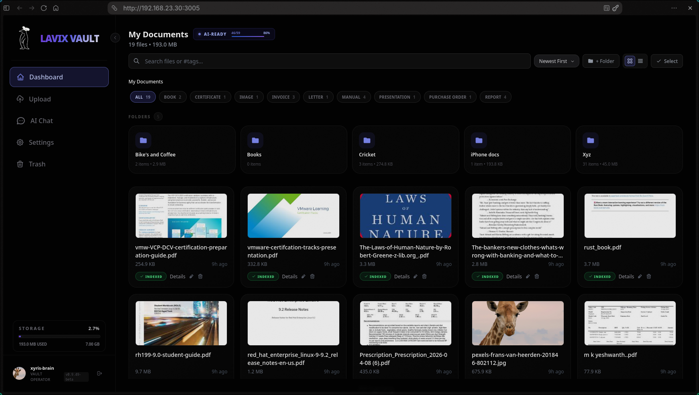
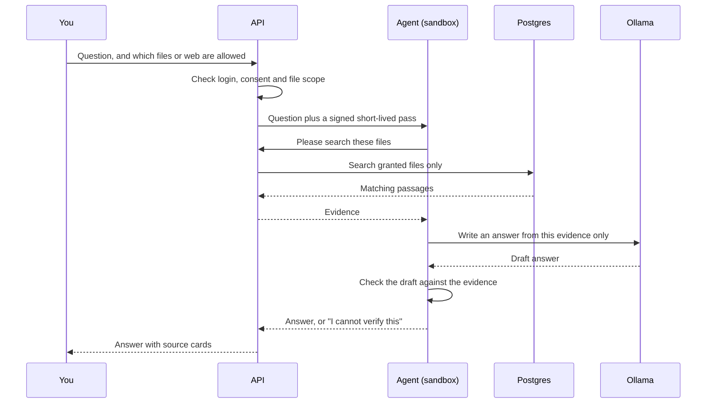
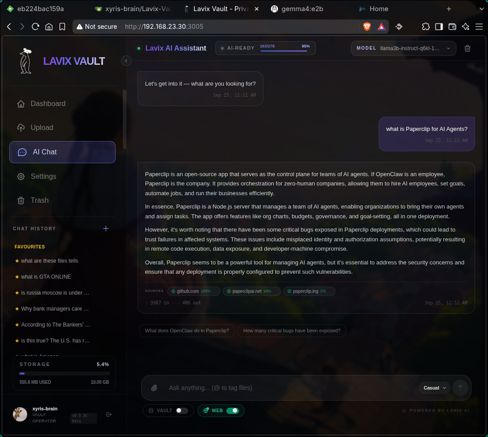
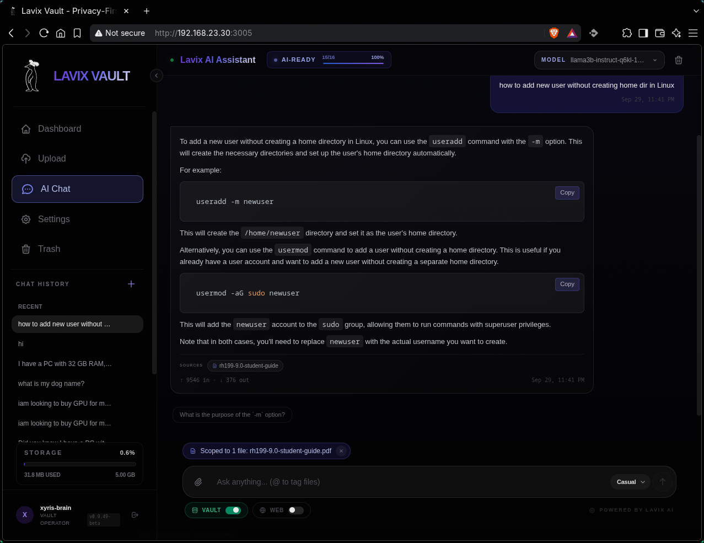
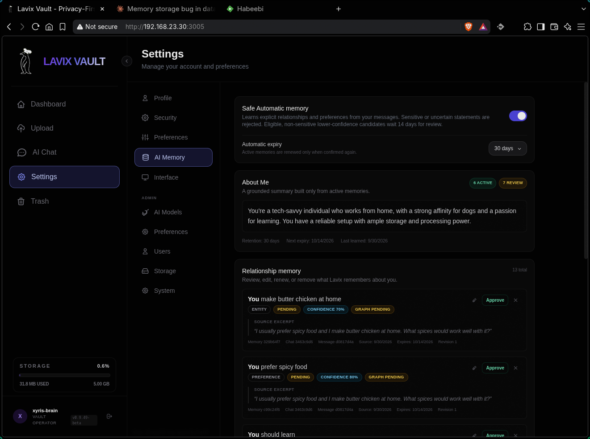
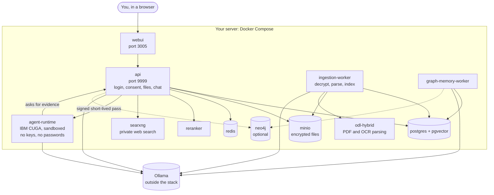

# Lavix Vault

**Where Encrypted Storage Meets AI-Powered Privacy.**

Lavix Vault is your private document library with an AI assistant. You upload
files, choose which ones the AI may read, and ask questions in plain language.
Answers quote your own documents, with the source shown next to each answer.

Everything runs on your own computer or server. Your documents are not sent
to a cloud AI service.


*Your files, thumbnails, and per-file AI status at a glance.*

> **Status: beta.** Expect rough edges. Do not use Lavix Vault as the only
> copy of files you cannot lose.

## Contents

- [Private web search](#private-web-search) · [Self-hosted
  AI](#self-hosted-ai)
- [Before you start](#before-you-start) · [Install, step by
  step](#install-step-by-step) · [First login](#first-login) · [Your first
  question](#your-first-question)
- [How it answers](#how-it-answers) · [Memory
  (optional)](#memory-optional)
- [What you can do](#what-you-can-do) · [See it in
  action](#see-it-in-action) · [The containers](#the-containers)
- [Everyday commands](#everyday-commands) · [Updating](#updating) ·
  [Settings](#settings-you-can-change) · [Troubleshooting](#troubleshooting)
- [Security hardening](#security-hardening) · [Documentation](#documentation) ·
  [License](#license)

## Private web search

SearXNG runs inside the stack with **no published port**, and web search is
off unless you switch it on. Search engines see your server's IP address but
not your browser, account, or cookies. Say "private", not "anonymous": the
query text itself still leaves the machine.

## Self-hosted AI

Ollama runs on your own hardware. Nothing goes to a cloud AI service. Tested
working set:

| Role | Model | Notes |
|---|---|---|
| Chat (LLM) | `llama3.2:3b` | Default chat and helper steps; a second 3B chat model was also switched in Admin Settings |
| Vision (VLM) | `qwen2.5vl:3b` | Images and scans |
| Embeddings | `snowflake-arctic-embed2:cpu` (1024 dims) | Set before first upload; changing later needs `reembed` |
| Embeddings alt | `nomic-embed-text` (768 dims) | Fresh install only |

Recommendation from this evidence: stay with small 3B models on CPU hosts;
they answer, see, and embed reliably. Larger instruct models can be selected
in Admin if installed, but are untested here — expect higher RAM use and
slower answers, and report what you find.

### Choose your models

Chat (LLM) and Vision (VLM) are set in Admin > AI models, not in the compose
file, and must be pulled in Ollama first. Embeddings are set in
`docker-compose.yaml` (`EMBEDDING_MODEL`, `EMBEDDING_DIMS`) **before the
first upload**. Changing them later needs a full re-embed — see
[Configuration](docs/configuration.md) for the exact commands.

The reranker can be `local` (built in), `external` (your own server), or `off`.

## Before you start

| You need | Why | How to check |
|---|---|---|
| A computer with **16 GB RAM** (32 GB is better), **4+ CPU cores**, **30 GB free disk** | The AI models and document parsing are heavy | `free -h` and `df -h` on Linux |
| **Linux, macOS, or Windows with WSL2** | The helper scripts are bash scripts | On Windows, run everything inside your WSL2 Linux terminal |
| **Docker 24+ with Compose v2** | Runs Lavix Vault | `docker compose version` |
| **Git** | Downloads the code | `git --version` |
| **openssl, python3 (with PyYAML), curl** | Used by the helper scripts | `openssl version`, `python3 -c "import yaml"`, `curl --version` |
| **Ollama**, reachable from Docker, with three models | Runs the AI | `curl http://localhost:11434/api/tags` |

Install links: [Docker](https://docs.docker.com/get-docker/) (on Windows use Docker Desktop with the WSL2 backend), [Ollama](https://ollama.com/download).

### Get the Ollama models

On the machine where Ollama runs:

```bash
ollama pull llama3.2:3b                  # chat, and small helper steps (always required)
ollama pull qwen2.5vl:3b                 # understands images and scans
ollama pull snowflake-arctic-embed2:cpu  # turns text into searchable vectors (1024 numbers per chunk)
```

The downloads are several gigabytes. Check them with `ollama list`.

### Work out your `OLLAMA_URL`

Lavix runs inside Docker, so "localhost" inside a container is not your computer. Use the row that matches your setup:

| Where Ollama runs | Set `OLLAMA_URL` to |
|---|---|
| On the **same computer** as Lavix | `http://host.docker.internal:11434` |
| On **another computer** on your network | `http://<ip-of-that-computer>:11434` |

By default Ollama only listens on the computer itself. Containers cannot reach it until you make it listen on all addresses by setting `OLLAMA_HOST=0.0.0.0:11434`. See the [Ollama FAQ](https://github.com/ollama/ollama/blob/main/docs/faq.md) for how on your system. If Ollama is open to your network, firewall port 11434 to the computers you trust.

---

## Install, step by step

Commands are for bash or zsh. Run them from the Lavix Vault folder.

**1. Download the code**

```bash
git clone <repository-url> lavix-vault
cd lavix-vault
```

**2. Create your encryption keys**

```bash
./scripts/generate-keys.sh
```

You should see `Keys written (gitignored, never commit them).` The keys are in the `secrets/` folder.

> **Back up `secrets/private_4096.pem` now**, somewhere safe and offline. If you lose it, your encrypted files **cannot be recovered**, by anyone.

**3. Create your passwords**

```bash
./scripts/gen-passwords.sh --write
```

This fills every `CHANGE_ME` password in `docker-compose.yaml` with a random value. You never need to type or remember them. You will see one `patched ...` line for each password.

Prefer your own? Edit the lines near the top of `docker-compose.yaml` yourself. Use only letters, digits, `_` and `-`. Use at least 16 characters (32 for `SECRET_KEY`, `AGENT_CAPABILITY_SECRET` and `SEARXNG_SECRET`). Every password must be different.

**4. Tell Lavix where Ollama is**

Open `docker-compose.yaml` in an editor (for example `nano docker-compose.yaml`) and find the line that starts with `OLLAMA_URL:` near the top. Replace `CHANGE_ME` with your address from the table above:

```yaml
OLLAMA_URL:       &ollama-url    http://host.docker.internal:11434
```

Keep the `&ollama-url` part. Only change the value after it. This is the one value the script cannot guess.

**5. Check your settings**

```bash
./scripts/preflight.sh
```

Every line should start with `ok:`. A line starting with `FAIL:` tells you exactly what to fix. It also warns you if Ollama cannot be reached or a model is missing. Run it again until there is no `FAIL:`.

**6. Start everything**

```bash
docker compose up -d --build
```

The first start is slow, because Docker builds the images and downloads AI parsing models. Later starts are much faster. `-d` runs everything in the background.

**7. Check that it is running**

```bash
docker compose ps
curl -fsS http://localhost:9999/api/health/ready
```

Wait until the main services say `healthy`. A few helper services run once and then show `Exited (0)`. That is normal. If something is not healthy after about ten minutes, see **Troubleshooting** below.

---

## First login

1. Open **http://localhost:3005** and **register** your account.
2. Make that account the admin. This needs access to the computer on purpose, so nobody can do it from the web:

   ```bash
   docker compose exec api python -m app.cli promote-admin YOUR_USERNAME
   ```

   Refresh the page, and log in again if the admin settings do not appear.
3. **Turn registration off:** Settings, then Admin, then Preferences. While registration is open, anyone who can reach the page can create an account. Do steps 1 to 3 in one sitting, and do not leave an internet-facing server open.

## Your first question

1. **Upload** a file.
2. **Allow AI access** to that file.
3. Wait for the "AI ready" box to show that the file is ready. A first file can take a few minutes on a computer without a graphics card.
4. **Ask** a question. Open the source cards under the answer to see the original text.

---

## How it answers

The Lavix API checks login, consent, and file scope, then signs a
short-lived pass (300 seconds, listing exactly the allowed files) for each
run and hands the question to the agent runtime: a separate sandboxed
container built on IBM's open-source CUGA agent framework (CUGA pinned to
commit `ef3eac3`, Apache-2.0; it uses `langchain-ollama` 1.1.0, MIT, only as
Ollama chat/message/tool adapters, plus `langgraph` 1.2.9, MIT, as a
dependency). The agent holds no database, storage, or key credentials, sits
on its own network, asks the API for evidence through a gateway, and can only
touch the files listed in its pass.

Lavix adds its own checks around it: answers must be grounded in evidence,
otherwise it says it cannot verify instead of guessing; sources are shown as
cards; per-run evidence is deleted afterwards.



Lavix Vault is an independent project and is not affiliated with or
endorsed by IBM.

## Memory (optional)

Memory remembers what you tell it across chats: preferences, facts about you,
and (with approval) relationship notes. It needs the AI permission plus a
consent switch, both on. Items expire after 30, 90, or 365 days (90 is the
default); low-confidence items wait 14 days for approval. Every item carries
its source excerpt. Two buttons clear it: one clears learned items, one
clears everything including pinned preferences. Sensitive content (passwords,
keys, tokens) is refused, never stored. Memory personalizes answers but is
never cited as evidence.

Neo4j is a graph copy of the same memory: PostgreSQL is the source
of truth and memory works without Neo4j. It runs by default; opt out with
`GRAPH_MEMORY "false"` plus `--scale neo4j=0`. In our comparison runs it
behaved as optional and experimental: no clear, repeatable recall difference
was measured (method and raw answers in the release report). Leave it off unless you want to
experiment.

## What you can do

- Store files encrypted; decide per file what the AI may read; revoke anytime.
- Ask questions with cited sources; scope with `@`; read scans and tables.
- Search the web only when you switch it on; keep opt-in relationship memory.
- Run it for several people: admin manages users, roles, quotas, registration,
  session timeout, and models.

## See it in action


*Your files, thumbnails, and per-file AI status.*


*A cited answer: every claim traceable to a source card.*


*Scope: tag any file with `@` and the question stays within it — nothing
else in the vault is read for that answer.*


*Relationship memory waiting for your approval — nothing is kept silently.*

## The containers



Only `webui` (3005) and `api` (9999) publish ports. `preflight`, `migrate`,
and `minio-init` run once per start and exit.

| Service | Image | Ports | Networks |
|---|---|---|---|
| preflight | busybox:1.37.0 | none | backend |
| postgres | pgvector/pgvector:pg15 | none | backend |
| redis | redis:7.4-alpine | none | backend |
| minio / minio-init | minio images | none | backend |
| migrate | lavix-vault:0.9.49-beta | none | backend |
| api | lavix-vault:0.9.49-beta | 9999:8080 | frontend, backend, agent-tools |
| webui | lavix-vault-webui:0.9.49-beta | 3005:8080 | frontend |
| ingestion-worker | lavix-vault-worker:0.9.49-beta | none | backend, document-processing |
| graph-memory-worker | lavix-vault:0.9.49-beta | none | backend |
| agent-runtime | lavix-vault-agent:0.9.49-beta | none | agent-tools |
| odl-hybrid | lavix-vault-worker:0.9.49-beta | none | document-processing |
| reranker | lavix-vault-reranker:0.9.49-beta | none | backend |
| searxng | searxng/searxng | none | backend |
| neo4j (optional) | neo4j:5-community | none | backend |

## Everyday commands

`docker compose ps` (status) · `stop` (keeps data) · `start` · `logs -f api`
· `--scale ingestion-worker=2` (faster bulk uploads) · `down` (removes
containers, keeps data) · **`down -v` deletes everything including data**.

Updating: back up, `git pull`, `docker compose up -d --build`, watch
`migrate` once. Never edit applied migrations.

## Settings you can change

In the EDIT block: `OLLAMA_URL` (required), `EMBEDDING_MODEL`/`EMBEDDING_DIMS`
(before first upload only), `RERANKER_MODE` (`local`/`external`/`off`),
`RERANKER_MODEL` (preset + rebuild), `GRAPH_MEMORY` (`"true"`/`"false"`),
`NEO4J_PASSWORD` (16+ chars, always checked). Full details:
[Configuration](docs/configuration.md).

## Troubleshooting

| What you see | What to do |
|---|---|
| Preflight `FAIL:` | It names the setting; fix and rerun |
| Port taken (9999/3005) | Stop the other program or remap the left-hand port |
| Ollama red in System | URL must work from inside containers (never `localhost`) |
| `VAULT SEARCH FAILED` | Retry once; file may still process, or Ollama is down |
| Logged out | Idle lock (default 2 h); sign in again |
| Stuck in processing | Large PDFs are CPU-slow; watch the worker logs |

Full table: [Troubleshooting](docs/troubleshooting.md).

## Security hardening

Verified from `docker-compose.yaml` and the Dockerfiles: non-root users
(10001, 10002, 101) · read-only root filesystems · all capabilities dropped
(`cap_drop: ALL`) · `no-new-privileges` · four segmented networks · only two
published ports · digest-pinned pulled images · hash-checked model downloads
at build time · hash-pinned Python dependencies (`uv.lock`,
`--require-hashes` agent lock) · secrets kept out of images (paths only) ·
fail-closed start-up gate (refuses `CHANGE_ME`/weak/duplicate secrets).

## Documentation

[Concepts](docs/concepts.md) · [Install](docs/install.md) ·
[Configuration](docs/configuration.md) · [User guide](docs/user-guide.md) ·
[Admin guide](docs/admin-guide.md) · [Operations](docs/operations.md) ·
[Troubleshooting](docs/troubleshooting.md) ·
[Security and privacy](docs/security-and-privacy.md) ·
[Architecture](docs/architecture.md) · [Reference](docs/reference.md) ·
[Development](docs/development.md)

## Contributing and reporting problems

See [CONTRIBUTING.md](CONTRIBUTING.md). Security reports follow
[SECURITY.md](SECURITY.md) — never a public issue.

## License

MIT, see [LICENSE](LICENSE). Third-party components and AI models:
[THIRD_PARTY.md](THIRD_PARTY.md). Lavix Vault is independent and not
affiliated with or endorsed by IBM.
