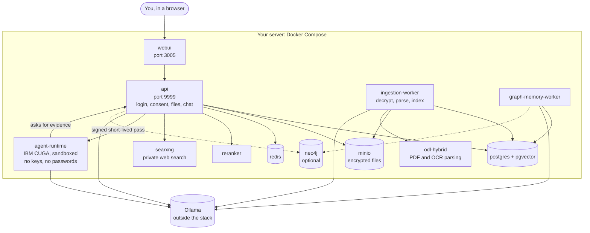
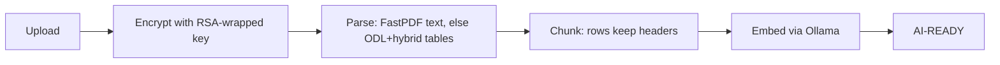
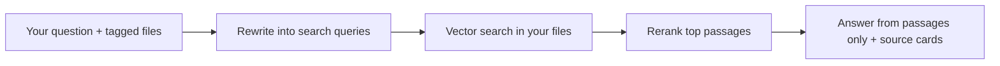

# Architecture

Who this page is for: curious users and contributors. One-line descriptions.

Only `webui` (3005) and `api` (9999) publish ports. `preflight`, `migrate`,
and `minio-init` run once per start and exit.

- `preflight`: refuses startup until credentials are set.
- `migrate` / `minio-init`: one-shot setup (tables; bucket + user).
- `webui` / `api`: what you see / what enforces the rules.
- `ingestion-worker` / `odl-hybrid`: upload-to-ready pipeline (below).
- `agent-runtime`: ask-a-question pipeline (below); holds no secrets, calls
  back with short-lived signed tokens. Built on IBM's open-source CUGA agent
  framework (pinned commit; LangChain only as Ollama adapters). One run at a
  time: a second question waits about 30 seconds, then gets an honest
  "agent busy" message. Each run gets a 300-second signed pass listing
  exactly its files; per-run evidence is deleted afterwards.
- `postgres` / `minio` / `redis`: system of record, bytes, scratch.
- `reranker` / `searxng`: answer quality / optional web.
- `graph-memory-worker`: opt-in preference learning. `neo4j` holds the
  relationship projection the worker maintains: graph-traversed recall on
  top, but PostgreSQL stays canonical — memory works fully without it, and
  the projection rebuilds from Postgres. Opt out with `GRAPH_MEMORY "false"`
  plus `--scale neo4j=0`.

Upload to ready:

Ask a question:

Next steps: [Reference](reference.md), [Development](development.md).
